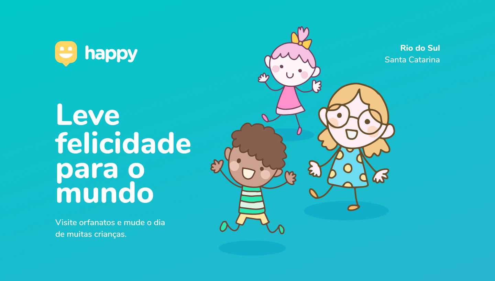

<h4 align="center">

</h4>

    
	
    

# About 🧾

Esse projeto foi desenvolvido durante a terceira edição da Next Level Week.

O **Happy**, com início de desenvolvimento no dia 12 de outubro(dia das crianças), tem o intuito de tornar a prática de visitar orfanatos mais comum no país, possui como principal funcionalidade conectar pessoas com orfanatos.
Assim como as outras edições da NLW, o projeto está separado em **três secções**, a **primeira** possui contém a aplicação web, a **segunda** seção contempla a aplicação mobile e a **terceira** é constituída pela API.

# Tecnologias utilizadas 🧰
- [**TypeScript**](https://www.typescriptlang.org/)
- [**Node.js**](https://nodejs.org/en/)
- [**Expo**](https://expo.io/)
- [**React**](https://pt-br.reactjs.org/) 
- [**React Native**](https://reactnative.dev/) 
# Main Libs 📚
  - [**TypeORM**](https://typeorm.io/)
  - [**Express**](https://expressjs.com/pt-br/)
  - [**SQLite3**](https://www.sqlite.org/index.html)
  - [**Axios**](https://github.com/axios/axios)
  - [**Expo Google Fonts**](https://github.com/expo/google-fonts)
  - [**Leaflet**](https://leafletjs.com/)

<h4 align="center">
	

</h4>
